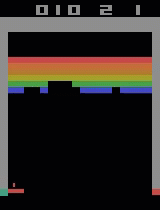

# Atari with Q-Learning
This directory contains the implementation of a Reinforcement Learning agent which plays the Atari game Breakout. The agent was trained with Q-Learning.

  

The Jupyter notebook contains all explanations from this README and the complete code. It can be used as a standalone. In additon the code is split in 2 .py files (training and playing) for adhoc usage.

A pretrained model was also added to serve as a showcase. The model is not fully converged, but archives an average score of 23 points per game.

## Introduction

In this notebook I will show how to train a reinforcement learning model to play Atari games. The approach that I will use in this notebook is based on the paper <b>Playing Atari with Deep Reinforcement Learning</b> by Mnih et al. from 2013. However, I will also add some recent state-of-the-art improvements, which I will discuss later. Since it is one of the most known games I have decided to pick the game "Breakout" for the showcase, which is shown in the Gif above.
  

The model will be trained with the method called $Q$-Learning. In this method the model tries to predict the $Q$-Value for a given action in a given state. The $Q$-Value stands for the "quality" of an action and the function $Q$ which outputs such $Q$-Values is called "action value function". $Q$-Values describe the sum of future rewards that the model expects to get if it takes certain a action $a$ in a given state $s$. 
  
  
$$\Large Q(a_t, s_t) =\sum_{t'= t}^T \mathbb{E} (r(a_{t'}, s_{t'})) $$
 

The optimal action value function can be described with the Bellman equation.

$$\Large Q^*(a_t,s_t) = r(a_t,s_t) + \gamma \sum_{s_t'} p(s_{t'} | s_t, a_t)\  \underset{a_{t'}}{max}\ Q(s_{t'}, a_{t'})$$

To put this equation in simple words: The optimal $Q$-Value of an action consists of the reward that the model gets for picking this action plus the discounted maximal $Q$-Value of the next state. The discount factor $\gamma$ discounts rewards which come later in the future and prevents the $Q$-Values from exploding in cases of infinite trajectories. 
  
 
The model that we will build will estimate such an action value function. For this we will use a neural network, which was proposed by Mnih et al. in 2013 and is called Deep Q Network (DQN). The trained model can then be used to play an Atari game. The model will select the best action by picking the action with the highest $Q$-Value in every given state.  
  
 
 
Lets begin with importing all modules that we need. To simulate the Atari game we will use the OpenAi's gym environment. Gym can be installed with !pip install gym and !pip install gym[atari] for the Atari games 
  
  
