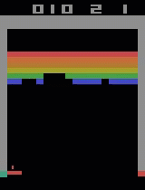

# Atari-with-Q-Learning-
This notebook shows and explains the implementation of a Reinforcement Learning agent which plays the Atari game Breakout. The agent was trained with Q-Learning.

  

All explanations, illustations and equations are provided in the notebook.
A pretrained model was also added to serve as a showcase. The model is not fully converged, but archives an average score of 23 points per game.
